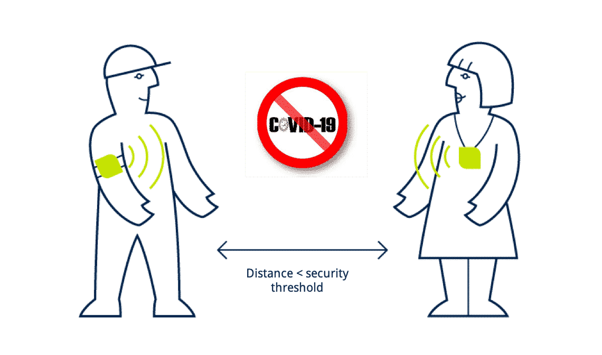

<h1 align="center">
  
</h1>
<h2 align="center"> c-Tracker </h2>

  <p align="center">
    An application that keeps the user aware of their environment's medical situation
    <br />
    <br />
    <a href="https://github.com/KrishPatel143/Debuggers/issues">Report Bug</a>
    ·
    <a href="https://github.com/KrishPatel143/Debuggers/issues">Request Feature</a>
  </p>
</p>


<!-- TABLE OF CONTENTS -->
<br />
<details open="open">
  <summary><h2 style="display: inline-block">TABLE OF CONTENTS</h2></summary>
  <ol>
    <li>
      <a href="#ABOUT-THE-PROJECT">ABOUT THE PROJECT</a>
      <ul>
        <li><a href="#Demo">Demo</a></li>
        <li><a href="#Built-with">Built With</a></li>
      </ul>
    </li>
      <a href="#GETTING-STARTED">GETTING STARTED</a>
      <ul>
        <li><a href="#Prerequisite">Prerequisite</a></li>
        <li><a href="#Installation">Installation</a></li>
      </ul>
    </li>
    <li><a href="#USAGE">USAGE</a></li>
    <li><a href="#CONTRIBUTION">CONTRIBUTION</a></li>
    <li><a href="#CONTACT-ME">CONTACT ME</a></li>
  </ol>
</details>


<br><br><br>
<!-- ABOUT THE PROJECT -->
## ABOUT THE PROJECT

<p align="center">
     <h4>  
       Ingenious Hackathon 3.0 <br> 
       Ingenious Hackathon is a part of Ingenium which is the technological festival of Ahmedabad University hosted at the School of Engineering and Applied Science        each year since 2016. The Ingenious Hackathon is a 36-hour intensive competition partnered with IEEE. The problems will be of a wide range and designed while         keeping in mind an industry-oriented approach with support from many other companies. <br>
    The Tracks for this year are:
    <ul> 
      <li> Healthcare</li>
      <li> Agrotech</li>
      <li> Fintech</li>
      <li> Mobility</li>
      <li> Blockchain</li>
       </ul>
    </h4>
<br>
<h4>
  <strong>What did we opted for and why? <br></strong>
      We choose Healthcare as it is an ever-expanding field with many real world problem statements that can be solved in this hackathalon.<br>
      We built an mobile web application that takes the location of the user (Latitude and Longitude) by asking the permission and checks in the database of all the positive patients and their current live location or their last known location and checks whether we came in contact or nearby any of them.<br>
  In case we did ever get near the covid positive patients, we would get the notification saying that we should be more precautious as we were nearby some patient.
 Each person will have their own account which they can create and log into to keep the possibility of the leak of location of everyone. 
 </h4>
 <br>
 <h4>
  <strong>Who will be in charge of changing the status of every patient? <br></strong>
      Any healthcare person will be in-charge of changing the status of certain person's health status as a way to minimize the possiblity of false negative status which in turn dis-courages possible fear and anxious environment. 
 </h4>
</p>
<br />

## Demo 

<video controls>
  <source src="https://github.com/KrishPatel143/Debuggers/blob/main/demo1.mp4" type="video/mp4">
  Your browser does not support the video tag.
</video>


<!-- BUILT WITH -->
## Built-with
<ol>
  <li> <a href="https://www.javascript.com/" target="_blank">JavaScript</a> - For creating the logic of the application </li> 
  <li> <a href="https://en.wikipedia.org/wiki/HTML" target="_blank">HTML</a> - For template making of the web page. </li> 
  <li> <a href="https://en.wikipedia.org/wiki/CSS" target="_blank">CSS</a> - In support to the HTML. </li>
  <li> <a href="https://nodejs.org/en/" target="_blank">Node.js</a>- In support of Firebase database </li> 
  <li> <a href="https://firebase.google.com/" target="_blank">Firebase</a> - Used to handle authentication and database of covid positive patients </li> 
  <li> <a href="https://getbootstrap.com/" target="_blank">Bootstrap</a> - Used to get templates for website </li> 
</ol>
  <br>


<br><br><br>
<!-- GETTING STARTED -->
## GETTING STARTED

<!-- PREREQUISITE -->
## Prerequisite 
<p align="left" > 
    &emsp;
   <a href="https://en.wikipedia.org/wiki/HTML" target="_blank">
  </a>
  &emsp; 
    <a href="https://www.wikipedia.org/wiki/CSS" target="_blank"></a>
  &emsp;
  </a> 
    <a href="https://javascript.com/" target="_blank"></a>
  </a> 
  &emsp;
  <a href="https://nodejs.org/en/" target="_blank"></a>
  &emsp;
  </a>
  <a href="https://getbootstrap.com/" target="_blank"></a>
  &emsp;
  </a>
</p>

<br>


<!--INSTALLATION -->
## Installation
<ol>
  <li> Clone the repo </li>
  
   ```sh
   git clone https://github.com/KrishPatel143/Debuggers.git
   ```
  
</ol>


<br><br><br>
<!-- USAGE -->
## USAGE

To use this project.
*  Complete the getting started part. </li>
*  To run the web application
    ```
    double click home.html
    ```


<br><br><br>
<!-- CONTRIBUTING -->
## CONTRIBUTION
Please refer to each project's style and contribution guidelines for submitting patches and additions. In general, we follow the "fork-and-pull" Git workflow.

 1. **Fork** the repo on GitHub
 2. **Clone** the project to your own machine
 3. **Commit** changes to your own branch
 4. **Push** your work back up to your fork
 5. Submit a **Pull request** so that we can review your changes

NOTE: Be sure to merge the latest from "upstream" before making a pull request!


<br><br><br>
## CONTACT ME

<p align="center">
	<a href="mailto:priyanshub5645@gmail.com"></a>
	<a href="https://github.com/BeholdenArt"></a>
	<a href="https://linkedin.com/in/priyanshu-bairwa-827432190"></a>
	<a href="https://www.facebook.com/priyanshu.bairwa.129794"></a>
	<a href="https://instagram.com/theblockedguy"></a>
	
</p>
